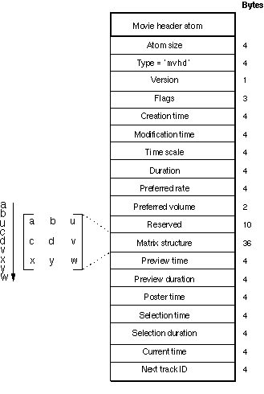

# 6. Reading the `mvhd` atom

An MPEG-4 compliant video container file contains a `mvhd` [atom](https://developer.apple.com/library/archive/documentation/QuickTime/QTFF/QTFFChap2/qtff2.html) which stores information about the duration  of the movie. This is a binary format with bytes laid out as below:

To get the duration of the video in seconds, divide the provided duration by the time scale.

---

Given the attached mvhd atom [mvhd.bin](testdata/mvhd.bin), what is the duration of the video it describes, in seconds?

<textarea id="answer" rows="10" cols="20" placeholder="paste your answer here" data-hash="56f84299b256b2e7fbf8bd3bec74edd15fd0769b053a910476dff3a1aa6fd342"></textarea>

<button id="check" type="button">Submit</button>

