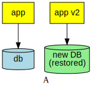
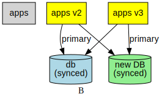

class: center, middle

# Live Database Migrations

In at least seven easy steps

---

# Easy database migrations

1. Take down the application

1. Create a new database

1. Restore data

1. Start the application


---

# But I don't want downtime

Fiiine...

1. Create a new database

1. Restore data

1. __Deploy new version of application__

1. Remove old application


---

# But I don't want to miss any data

Fiiine...

1. Create a new database

1. Restore data

1. Deploy app v2

1. __Backfill gap in data__ between (2) and (3)

1. Remove old app

<div style="display:flex">



</div>

---

# But I tried this and I'm getting constraint violation errors

```
ERROR:  duplicate key value violates unique constraint "profile_0_pkey"
DETAIL:  Key (id)=(4) already exists.
```

Why?

---

# Here's what happened...

<center>
<table border="1" style="empty-cells:hide; font-size: smaller">
<tr><th>v1</th><th>v2</th</tr>
<tr><td>1</td><td></td></tr>
<tr><td>2</td><td></td></tr>
<tr><td>3</td><td></td></tr>
<tr><td colspan="2">(snapshot)</td></tr>
<tr><td>4</td><td></td></tr>
<tr><td>5</td><td></td></tr>
<tr><td colspan="2">(deploy v2)</td></tr>
<tr><td>6</td><td>4</td></tr>
<tr><td>7</td><td>5</td></tr>
<tr><td colspan="2">(cutover)</td></tr>
<tr><td></td><td>6</td></tr>
<tr><td></td><td>7</td></tr>
<tr><td colspan="2">(backfill<br>attempt)</td></tr>
<tr><td colspan="2">(uhoh...)</td></tr>
</table>
</center>

---

# But I still don't want to miss any data

Fiiine...

1. Create a new database

1. Restore data

1. __Bump any ID sequences forward__, leaving room to backfill missing data

1. Deploy app v2

1. Backfill gap in data between (2) and (4)

1. Remove old app

Remember to bump the ID sequence even further on the source database, otherwise you can't roll back.

---

# The fixed migration

<center>
<table border="1" style="empty-cells:hide; font-size: smaller">
<tr><th>v1</th><th>v2</th</tr>
<tr><td>1</td><td></td></tr>
<tr><td>2</td><td></td></tr>
<tr><td>3</td><td></td></tr>
<tr><td colspan="2">(snapshot)</td></tr>
<tr><td>4</td><td></td></tr>
<tr><td>5</td><td></td></tr>
<tr><td colspan="2">(bump seq)</td></tr>
<tr><td colspan="2">(deploy v2)</td></tr>
<tr><td>6</td><td>1000</td></tr>
<tr><td>7</td><td>1001</td></tr>
<tr><td colspan="2">(cutover)</td></tr>
<tr><td></td><td>1002</td></tr>
<tr><td></td><td>1003</td></tr>
<tr><td colspan="2">(backfill)</td></tr>
</table>
</center>

---

# But now I don't want stale data

Fiiine... (part 1)

1. Create a new database, restore data

1. __Deploy app v2 to write to both DBs, but read from original__

1. Bump any ID sequences forward, leaving room to backfill missing data

1. Backfill gap in data

<div style="display:flex">


</div>

---

# But now I don't want stale data

Fiiine... (part 2)

1. Remove old app

1. __Deploy app v3 to switch to the new DB__

1. Remove old app v2

<div style="display:flex">


</div>

---

# But I have multiple apps using the same DB

What this means in English™

* Any database used as a primary, _at any point by any app_, needs to be fully in sync
    
    This implies that any updates made on _either_ DB need to be visible to _both_ DBs

* If you use any non-atomic rollout (e.g. DNS), app v2 and app v3 actually count as "multiple apps"

    So basically you can't avoid this

---

# But I have multiple apps using the same DB

1. ...Deploy apps v2 to write to both DBs, but read from original

1. __Delete window of data from new DB__
    ...or do a fancy upsert on backfill

1. ...Bump sequences, backfill gap in data...

1. __Run consistency checks__, remove app v1

1. __Deploy apps v3 to write to both DBs, but read from new DB__

<div style="display:flex">


</div>

---

# But I have multiple apps using the same DB

Finally...

1. Deploy apps v4 to switch to the new DB

1. Remove old apps

<div style="display:flex">


</div>

---

# Summary

* Always prefer to cop a small amount of downtime if you can get away with it

* There really should be an easier way to do it properly

    ...but if there is, do we trust it?

* When in doubt, do the full eight step process. If you think you can get away with skipping a step, you probably can't

---
class: center, middle

# Thanks!

Please direct any ops questions to Jeff and Rich
